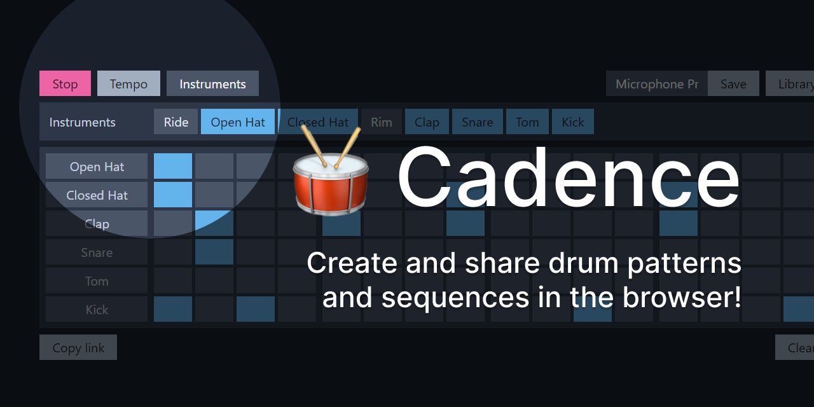

# Cadence

🥁 Create and share drum patterns and sequences in the browser! <https://focused-galileo-7aaf5d.netlify.com>

This project is part of [#CreateWeekly](https://dev.to/josephuspaye/createweekly-create-something-new-publicly-every-week-in-2020-1nh9), my attempt to create something new publicly every week in 2020.

## Features

Cadence allows you to:

- Create 16-note drum patterns using 8 drum instruments: Ride, Open Hat, Closed Hat, Rim, Clap, Snare, Tom and Kick
- Set the beat tempo anywhere between 30bpm and 240bpm
- Save multiple beats locally in your browser
- Easily share your beats with others using a unique URL

Cadence uses [Tone.js](https://tonejs.github.io/) to access the [Web Audio API](https://webaudio.github.io/web-audio-api/).

## To-Do

- [ ] Add other samples for different drum sounds
- [ ] Add playback progress indicator (playhead)

## Contributing

See [contribution guide](CONTRIBUTING.md).

## Licence

[MIT](LICENCE)
